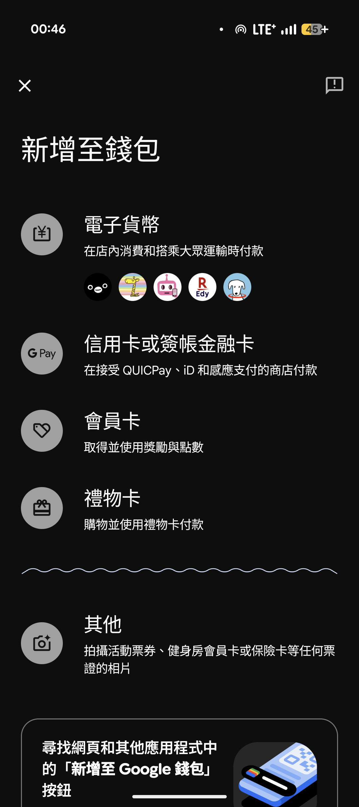
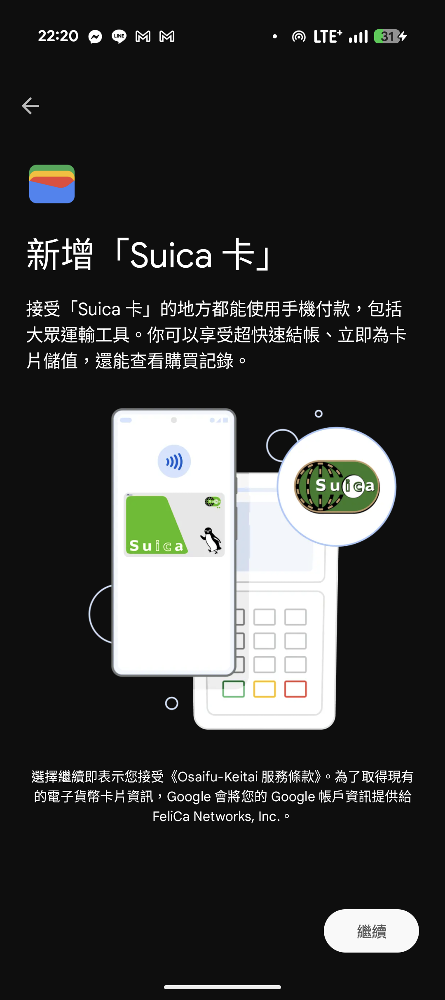
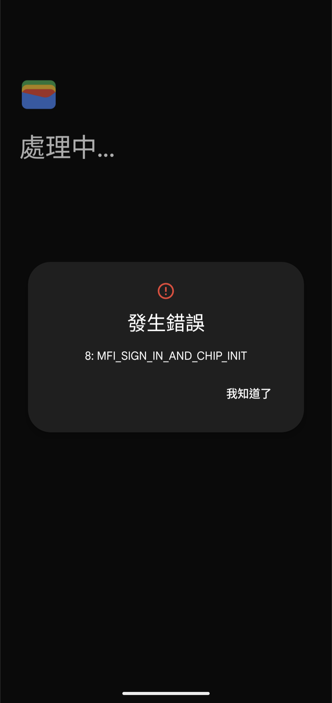
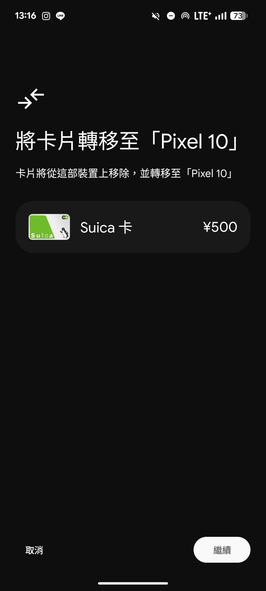
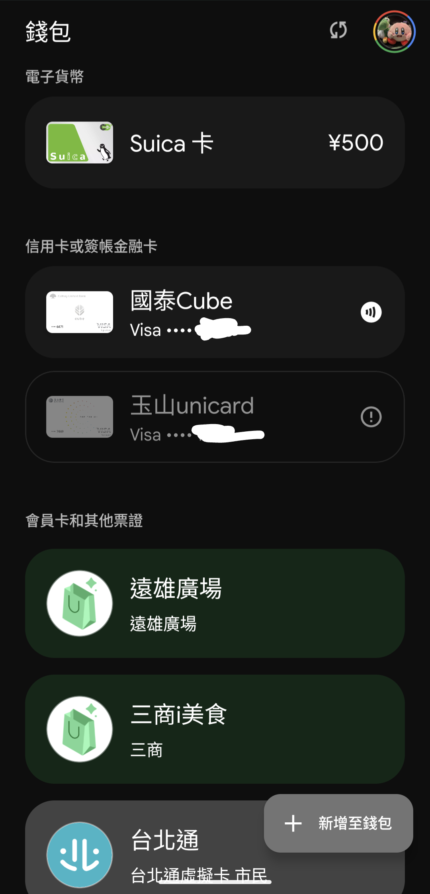

*2026/2 更新在日本實測的一些細節

先說明一下，我在這裡使用的手機分別是 Pixel 6 以及 Pixel 10，另外安裝的步驟均參考[這篇文章](https://www.mobile01.com/topicdetail.php?f=565&t=7164410)

Android 使用者可能會很羨慕 iPhone 使用者到日本可以直接刷交通卡，而我們還是需要掏出實體卡，在旅行中拖著大包小包還要從包包挖出卡片稍嫌麻煩。這是因為日本的交通卡採用的是 felica 技術，通常只有日本版的手機才有辦法啟用。而 iPhone 跟 Pixel 是目前唯二在全球發行的手機都有相關硬體設備，但是 iPhone 並沒有對此設下太多限制，Pixel 則是以韌體版本判斷機種是否為日本版進行啟用。總之如果想要在台灣能夠用悠遊付嗶乘車，在日本同時能刷 suica 的話就是只有 Pixel 做得到。

能夠讓非日版 Pixel 啟用 felica 的程序有兩種，這兩種方法都無可避免需要重置手機，因此都需要預先備份資料。

1. 修改韌體版本為日版，程序較為麻煩，且拍照時快門聲會關不掉（經個人實測，用台版機使用日本 sim 卡聲音也會關不掉），不過也可以再刷回解決。
2. root 後使用模組騙 app 是日版進行設定再刷回。

本文使用第二個方法。

安裝前的狀況是未申請過任何 SUICA 等的帳戶，另外也是剛將手機資料從 Pixel 6 換到 Pixel 10，（當初應該要先處理完再做資料移轉，**強烈建議未來拿到新機都先做這些程序再做資料移轉**），所以會有一些處理上比較麻煩的部分（特別是銀行、信用卡之類的）。

很抱歉我在嘗試的過程中並沒有進行截圖，所以不少地方都沒有圖片請見諒。

## 先置步驟

因為我們會需要能夠載幾個只能夠使用日本 Google 帳戶安裝的 App，所以需要開一個日本 Google 帳戶（或是拿一個沒有綁過信用卡消費的帳戶）。依照一般程序辦完帳戶（不要填電話號碼或住址，不確定填了之後會發生什麼事，從手機辦帳戶可以跳過這幾步）

找個日本 VPN 連(Play 商店有一些免費的)，請注意不要連到 IP 219 開頭的，地區會被判定成美國。並下載 Google 意見回饋獎勵，使用剛剛的帳號登入，請到旁邊的問卷調查資格條件尋找語言偏好設定，將地區設定為日本。去 Play 商店檢查自己的地區是否真的在日本再關掉 VPN

## Pixel 6

### 手機上

我是先在 Pixel 6 進行測試，首先先打開開發人員選項（關於手機>版本號碼按六下），之後開啟 OEM 解鎖以及 USB 偵錯。之後關機。

關機完同時按電源鍵和下音量鍵進入 bootloader，這時候有 lock(unlockable) 就可以繼續了。

### 電腦上

接著是電腦這裡，請[安裝 SDK Platform-Tools](https://developer.android.com/tools/releases/platform-tools?hl=zh-tw)，解壓縮，並把 fastboot 所在的路徑加入環境變數（Windows: 去找編輯環境變數，macOS/Linux: Terminal 輸入`export PATH==$PATH:<路徑>`並重啟 Terminal）。

接著用線連上手機，執行 `fastboot flashing unlock` 解鎖，此時手機如果再開 bootloader 就會寫 unlock 了。之後任何 flash 指令都是在開啟 bootloader 的狀況下執行。

**不管怎樣 unlock 一定會清資料**，請務必備份好需要的資料。特別是各大網銀（尤其是公股銀行通常需要裝置綁定碼，沒有的話都要跑臨櫃）、Line 還有我們公司在用的 Duo 務必先在另一台手機設定好。

這個時候到[這裡](https://developers.google.com/android/images?hl=zh-tw)找到對應版本的原廠韌體。下載在電腦解壓縮之後裡面會還有另外一層 zip。裡面有 `init_boot.img` 或 `boot.img`。（註：建議使用前者，然而 Pixel 6 並沒有提供，Pixel 10 有提供，其他版本並沒有另外測試）請想辦法丟到手機上（Quick Share 好用）

### 手機上

回到手機，請安裝 [Magisk Manager](https://magiskmanager.com/)，然後進去後點 Magisk 旁邊的安裝，選擇剛剛傳過來的 img 進行修復。完成後他應會顯示一行

``` Output file is written to /storage/emulated/0/...../magiskxxxxxxxxxxx.img```

請找到這個檔案，再把它傳回電腦。

### 電腦上

回到電腦，在剛剛的那個 img 所在的目錄執行 `fastboot flash init_boot magiskxxxxxxxxxxx.img` 就會成功 root 了

### 手機上

之後下載 [unlock-felica-pixel](https://github.com/jjyao88/unlock-felica-pixel) 這個模組，直接載那個 zip 檔在手機，到 magisk 按右下角的 module 並直接把 zip 丟進去。

然後請到 Play 商店用日版 Google 帳號下載這些軟體（四個都要有才能使用）：
- おサイフケータイ アプリ 
- おサイフケータイ 設定アプリ
- モバイルFeliCaクライアント
- Google Play services for payments

接著打開 Google 錢包就會看到以下畫面



這裡共有五種貨幣可供選擇，分別是 Suica、nanaco、PASMO、Edy、WAON。其中通路最廣能在最多地方乘車的是 Suica 跟 PASMO（因為這兩間都在交通系ICカード全国相互利用サービス，彼此間通路是互通的），然而 PASMO 基本上鎖國外信用卡，這裡基本上只能用 SUICA。不過 SUICA 有不少信用卡儲值被鎖卡的先例，要特別注意。ICOCA 雖然較無這種情況，但是並沒有被整合進 Google 錢包，需要另外去おサイフケータイ設定，所以這邊還是建議使用 SUICA。

接著進入按新增，會要求你填一些個人資料，與上面參考文章不同的是我這邊是直接在 Google 錢包裡面填資料。這邊注意郵遞區號地址跟電話需要是日本的，但他不會另外驗證。然後請記得你填的資料，到時候被鎖卡要拿這些資料去申請解卡。

然後就順利將這張卡加入了，之後可以不解鎖刷閘門。這邊也可以直接在 Google 錢包裡面加值（海外信用卡似乎只能使用 JCB，我這邊使用的是富邦J卡，特別注意台灣的 JCB 卡都不能設定感應支付，但是仍可以用來支付加值款項），實測成功。

之後就是把手機 unroot 並 lock 回去。有人會在這裡維持 root，但是我這邊的建議（或著說我個人的需求）是不要。首先是資料會不安全，另外想把資料從另一台手機備份回來很多應用程式資料會不給複製。還有在 root 下是沒辦法感應支付信用卡的，各大網路銀行 app 也會擋 root。雖然市面上有套件是可以偽裝不 root 再進入這些 app，但是與其在那邊玩 root 躲貓貓不如直接鎖回去。不過鎖回去會有的缺點就是おサイフケータイ無法直接打開（如果只是偶爾去日本玩的話這部分倒還好，只要有一張能刷的 Suica 就很夠了）。

### 電腦上

這邊請回去使用刷機，也就是上面載下來的韌體zip檔案會有個 flash-all.sh(for macOS or Linux) 或 flash-all.bat(for Windows)。執行它，需要花一點時間，這裡手機會再重置一次。之後再 `fastboot flashing lock` 鎖回去（兩個動作皆要在手機是 bootloader 的時候做）。

### 手機上

這邊可以開始轉移資料。記得一樣把剛剛那四個 app 用日版帳號載下來，但不需要打開。直接進 Google 錢包一樣會有電子貨幣的選項，之後再點 Suica，這時應該會有「發現既有的 Suica卡 卡」，點一下就能拿回這張卡並且正常使用手機了。

不過這邊特別注意，開啟おサイフケータイ之後是無法使用墨爾本 myki 以及大多倫多 PRESTO 這兩張交通卡（目前沒有測試把おサイフケータイ刪掉會發生什麼事）。而對八達通的影響仍不確定（都是 Felica 的話可能影響不大），另外也不確定未來如果一卡通推廣到 Pixel 上面會不會與 Suica 衝突。目前悠遊付嗶乘車仍能正常使用

## Pixel 10

當你興高采烈地在舊手機成功做完，然後在新手機上面裝了那四個 App 並點開 Google 錢包發現有 Suica 可以按欸，結果





因為這支手機是沒有啟用過 Felica 的，任何非日本的 Pixel 手機都還是需要啟用晶片，也就是上面的流程再跑一遍。這邊建議在轉移手機資料前先啟用完再進行資料轉移，不然就像我一樣需要從舊手機轉到新手機又轉回舊手機又轉到新手機，非常愚蠢。

再跑一遍的時候點選新增 Suica 卡時，會有從其他裝置轉移 SUICA 卡的選項，反正順著操作就對了（下圖是舊裝置的畫面）



重新刷回鎖上，依循一樣的方法設定就可以了。



# 當地實測

我到當地帶了兩隻裝置，分別是 unroot 過後的 Pixel 10，內有從 Google 錢包啟用的 SUICA 和 PASMO 綁在臺灣 Google 帳戶下，以及 root 狀態下的 Pixel 6 從 Osaifu-Keitai 啟用的 ICOCA 一張。另外也有測試啟用其他幾張電子貨幣，但沒有實際使用，以下這些應該是都可以現金儲值的，我並沒有實測。

- WAON: 無法使用海外任何卡儲值，辦帳號需要日本手機號碼驗證。但可以透過 Google 錢包啟用。
- nanaco: 開帳號不需日本手機號碼驗證，但是官方本來就公告只能使用特定幾張日本信用卡儲值。
- 樂天 Edy: 開帳號日本手機號碼驗證，啟用本身需要有日本 IP 不然無法使用。在日本 IP 下似乎可以使用海外信用卡，但我沒有實測。

接著是三張交通卡。除了信用卡儲值之外也可以現金儲值，但是因為大多數的儲值機台都是要把卡插進去的，只有少數幾台是用放的才能把手機放進去儲值。這些機台大多是在超商內（不是每間都有）或是車站閘內的精算機那裡才會有，車站外面的機器通常都是要插入的。

## ICOCA

這張是問題最少的，唯一的缺點就是不能用 Google Wallet 開啟並切換。啟用需要透過 Mobile ICOCA 啟用，要有一個 WESTER 帳號（不需要日本手機號碼驗證）。儲值也只能透過 Mobile ICOCA 。開卡強制要儲值 1000，之後可以以 1 日元為單位儲值，最少 500。卡片的話應該是沒有特別擋海外卡，雖然我只綁了玉山銀行的 JCB 實測儲值是可以的。（Mobile ICOCA app 我似乎沒有找到可以換信用卡的選項）這張並沒有另外兩張卡有一些有的沒有的限制，也可以累積 WESTER 的點數，問題只有使用了這張卡在 unroot 狀態下是沒辦法切去使用其他張卡的，或著說切走了之後沒辦法切回來。如果你不介意沒有 Google 錢包的介面而且你也覺得你不需要去切換成另外兩張卡的話會建議就啟用 ICOCA 就好（當然你也可以乾脆維持在 root）。有個題外話是我似乎不小心讓我 root 的 Pixel 6 去系統更新了所以現在又變回 unroot 沒辦法開 osaifu-keitai 了。還有這隻手機我沒有裝 sim 卡，沒有網路的狀態下是不能儲值的，連打開 app 查看餘額都不行，就跟一張實體卡一樣。

## PASMO

這張最大的問題是不能使用海外信用卡儲值，不過有個例外情況：當在日本時（不確定是否也需要手機是裝日本 sim 卡），可以透過 Mobile PASMO app 裡面綁定海外的 Mastercard 來儲值（我是台新銀行的卡）。首先 Google 錢包那裡本來就會限制海外卡不能儲值，Mobile PASMO 只要是海外信用卡的 JCB/VISA 等等都是沒辦法綁定的，Mastercard 在地區不是日本的情況下是可以綁定，但到了儲值那一步就會失敗，僅有在日本時可以成功儲值。有在台灣試過啟用日本原生的 esim 加上開日本 VPN 仍然會儲值失敗，所以大概只有真的在日本才可以（但我也沒有給這個 app 定位權限，不知道實際判定方法還有什麼）。至於 sim 卡是不是需要是日本的我就不是很確定了。另外 Mobile PASMO 儲值的限制是只能儲他指定的金額 500/1000/2000 等等。另外這張可以透過 Google 錢包裡面跟 SUICA 切成主卡。在非主卡下仍然可以用 Mobile PASMO 儲值（反之亦然），我這次多次切換都沒有什麼太大的問題，不過我沒有另外測斷網狀態下切換會發生什麼事。

## SUICA

這張真是讓人又愛又恨，首先他是 Google 錢包可以啟用的所以可以看到精美的扣款動畫，也是可以透過 Google 錢包或是 Mobile SUICA 使用海外的 JCB 儲值，但是最大的問題就是**信用卡儲值上限**。這是個 JR 東日本聲稱為了防止不當使用做出的限制，使用信用卡儲值只能儲個一定的金額就沒辦法繼續儲值，也沒有說這個限制是多少，官方的說法是多去購買商品或是搭乘交通工具就可以繼續儲值了，但實測是次數多少似乎都沒什麼用。這個問題是日本人自己也會碰到的問題，網路上也有一些討論。而蘋果手機透過 Apple Pay 儲值不會有這個問題。也有人實測一開始是 30 天內最多只能用信用卡儲值大約 3000 ，我分了好幾個月儲值了 8000 之後就儲不動了，之後過 30 天可能可以再測試一下。解決方法日本網友提供的包含寫信（似乎很容易被拒絕）、啟用自動儲值（海外信用卡似乎沒辦法）、使用 JRE Point 儲值（大概只能小補），或是轉到另外一隻 iPhone 用 Apple Pay 儲值再轉回來（那不是乾脆直接用 iPhone 就好了？）偏偏有一個東西只能用 SUICA，就是 JR 東日本管區內的 Green car 券的購買，要透過 Mobile SUICA 裡面買，不過這裡就是直接刷信用卡購買而不是扣裡面的款項。

總之海外的 Android 要啟用這些真的是很麻煩，可能倒不如直接買個 iPhone 備用機來用，畢竟很多間銀行的日本交通卡儲值優惠還是限制用 Apple Pay 才領得到。